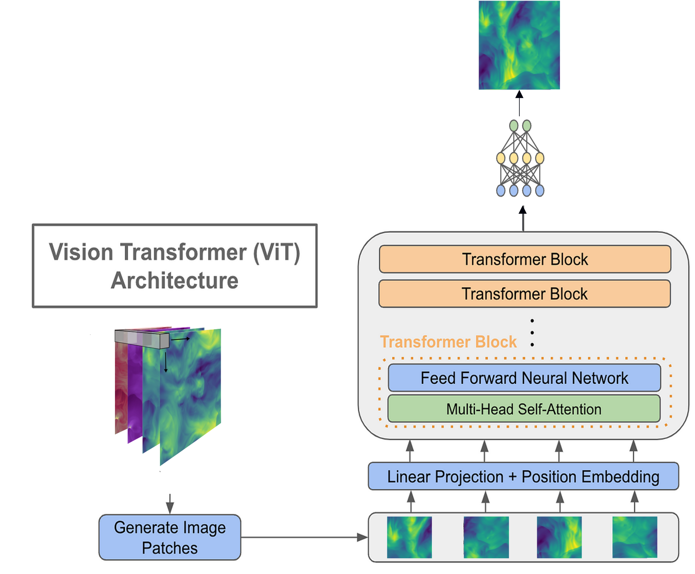

Creating machine learning surrogate models that capture the dynamics of physical systems is a field that has seen rapid development in recent years. However, creating these models from scratch are both time consuming and data intensive. Foundation models for PDEs that can be finetuned to specific systems of interest offer a solution to this problem.

Most physical systems of interests share common physics between them. The goal is to create a model that is trained on multiple physics from diverse datasets, that is able to capture these common features and understand behavior of these systems across different scales. While efforts have started in this direction [^1],[^2] , there are many questions to be explored regarding choice of model architecture, creation of larger and more diverse datasets, training strategies, and the effects of boundary conditions and geometries.

We can currently working on building a Vision Transformer that generalizes across the parameter space of a given PDE. Expect to see the paper on ArXiv soon.

[^1]: [Shashank Subramanian, Peter Harrington, Kurt Keutzer, Wahid Bhimji, Dmitriy Morozov, Michael Mahoney, & Amir Gholami. (2023). Towards Foundation Models for Scientific Machine Learning: Characterizing Scaling and Transfer Behavior.](https://arxiv.org/abs/2306.00258) 
[^2]: [Michael McCabe, Bruno Régaldo-Saint Blancard, Liam Holden Parker, Ruben Ohana, Miles Cranmer, Alberto Bietti, Michael Eickenberg, Siavash Golkar, Geraud Krawezik, Francois Lanusse, Mariel Pettee, Tiberiu Tesileanu, Kyunghyun Cho, & Shirley Ho. (2023). Multiple Physics Pretraining for Physical Surrogate Models.](https://arxiv.org/abs/2310.02994)
